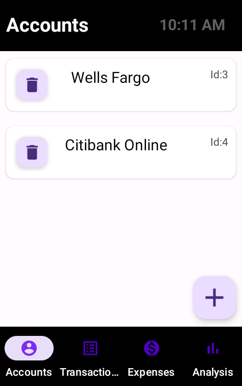
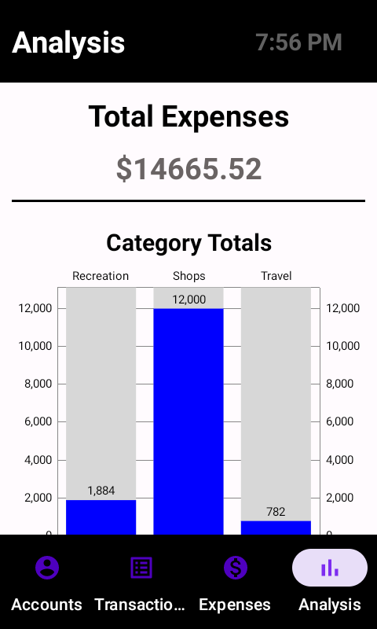

# An Expense Management Application using Plaid API

## Description

This project focuses on the exploration of financial technology applications through the use of the API made by Plaid, a financial technology company themselves. They facilitate the actions of account linking, transaction polling and much more. However this project mainly uses their account linking and transaction endpoint products. This work, in the form on an Android Application showcases the Plaid API at work by allowing the user to link multiple accounts, see their transactions for each account, and add and delete to an expense sheet as they please. All stored locally on device. Once a user is satisfied they may see the analysis page which showcases their total expenses and a simple visualization of their expenses as a bar graph. 

## Project Structure

The flow of the application:
- [Plaid API] -> [Python Backend] -> [Android Application]
- [Plaid API] <- [Python Backend] <- [Android Application]

Backend:
- Written python can be found here: https://github.com/franny1615/cap_backend
- follows the Plaid Quickstart python example with minor tweaks for this project purposes
- uses the Flask, and Plaid API modules to run internet request and communicate with the Plaid API. 
- currently running for free through heroku, may be slow when queried.

Android: 
- Each view is construct using the View, Viewmodel, Model paradigm
- Googles Room abstraction layer is used to store user data
- Volley dependency is used to run internet request to the Python backend
- Googles Materials library is used for styling
- MPAndroidChart by Phil Jay is used, can be found: https://github.com/PhilJay/MPAndroidChart

Plaid: 
- a developer account can be made here: https://dashboard.plaid.com/signup
- how to set up the account and get the secret keys ready: https://plaid.com/docs/quickstart/

## Running the project

Assuming basic knowledge on using Android Studio the project can be cloned using the VCS system built into the IDE, or can be forked over the command prompt or terminal window using git(and then imported to IDE of choice that can run Android projects). Once loaded, and ran on simulator the application can be played with.

Features:
- Multiple Account links
- Automatic aggregation of transactions on first load 
- Adding and removing individual transactions to expense list
- Sorting of expenses by date, category, date and category
- Analysis screen with total expense sum, category sums, and category visualization

## Screenshots

